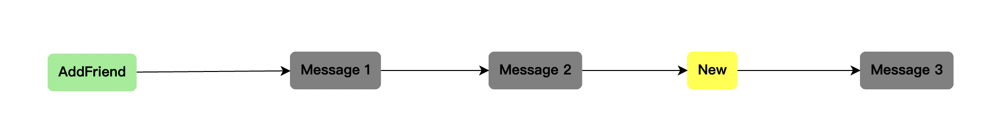
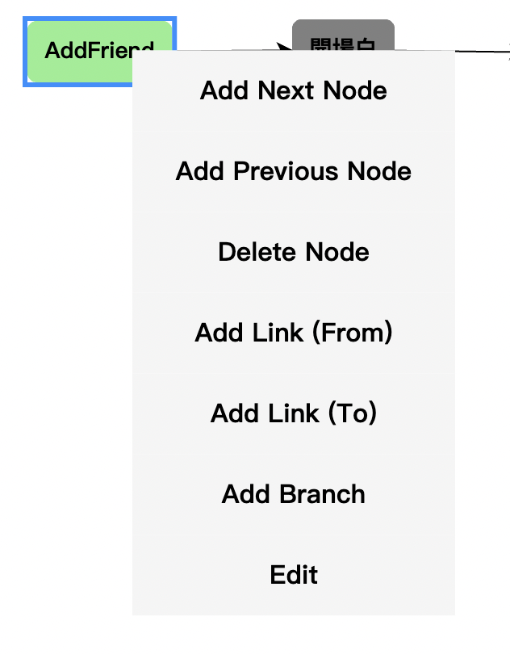
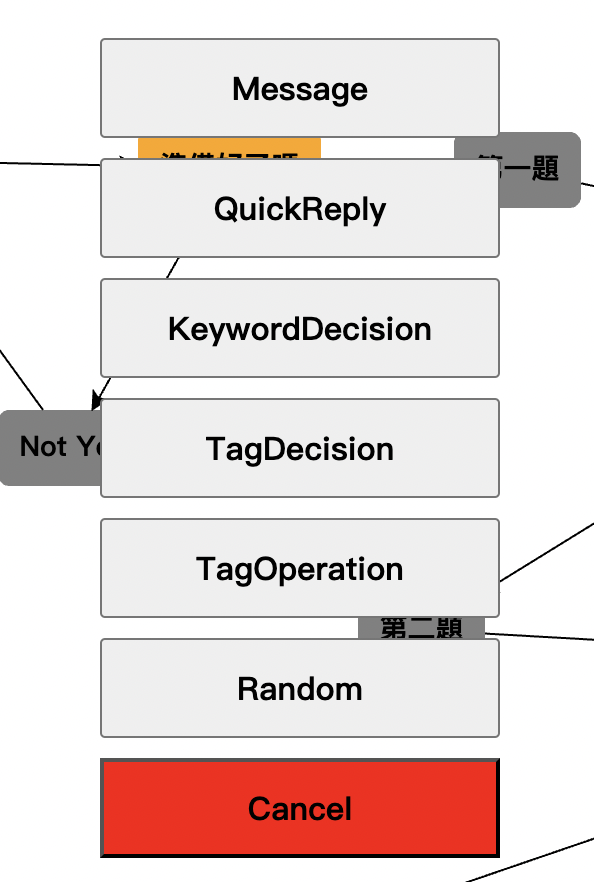
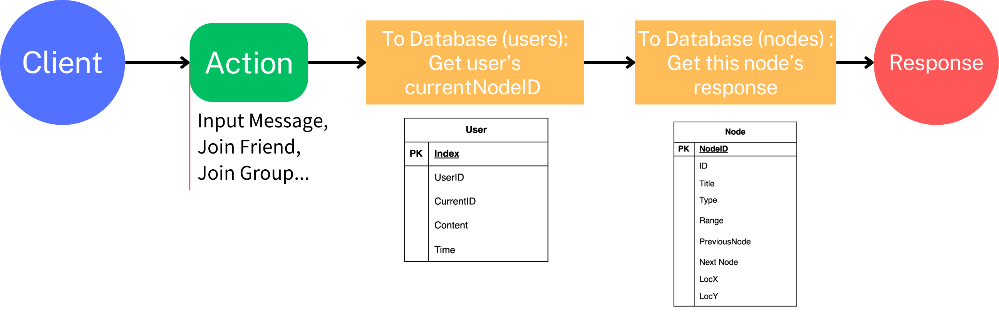

# Purpose
許多密室逃脫及實境解謎遊戲使用 LineBot 平台作為解謎遊戲的輔助工具，其中最常見的方式是業者透過編輯遊戲劇情，讓玩家與 LineBot 對話，並以輸入關鍵字的方式進行闖關。

目前市面上有一些付費工具可以幫助使用者編輯劇本並實現 LineBot 的後端操作，這些工具功能強大，但如果只是製作遊戲劇本，並不需要這麼多的功能。而且這些工具通常需要每月訂閱才能持續使用，對於一些小型工作室來說，這是一筆不小的負擔。

受到某密室逃脫業者的委託，我希望能開發一款簡單易用的 LineBot 劇本製作工具，後續稱為 LineBot Script Creator (LSC)，並搭配製作相應的 LineBot 後端程式，希望能降低使用 LineBot 機器人的成本。

# Objectives
## LineBot Script Creator(LSC)
1. 建立編輯劇本的頁面。
2. 簡易的編輯界面。
3. 可依劇本彈性編輯且自由搭配LineBot中的功能(Message, QuickReply...)。
4. 將編寫的劇本輸入Database中供後續LineBot使用。

## LineBot Backend Program
1. 抓取Database中的劇本。
2. 根據劇本及使用者的狀況回應對應的資訊。
3. 記錄目前使用者的遊玩階段。

# Tool
1. Frontend:
	- GoJS:是一個JavaScript庫，用於構建互動式的圖形和圖表，特別適合用於可視化的Node與Node之間相連的視覺化效果。
2. Backend: 
	- Golang:語法簡潔，開發效率高，能夠快速構建穩定的應用程序且具有良好的並發處理能力，適合處理高流量的請求。
	- Gin:是一個用 Go 語言編寫的輕量級Web框架，專注於高性能和簡單性。
	- Gorm:是一個 ORM（物件關聯對映）庫，用於簡化 Go 語言中的資料庫操作。支持多種資料庫（如 MySQL、PostgreSQL），方便資料庫切換。
3. Database: 
	- PostgreSQL:是一個功能強大且開源的關聯型資料庫管理系統。具備高擴展性，適合處理大型應用的數據存儲需求。
4. Other:
	- Docker:開源平台，用於自動化應用程序的部署、擴展和管理。
	- LineBot SDK: 用於開發 Line Bot 的開源軟體開發工具包，提供與 Line 平台的互動接口。提供豐富的 API 支持，能夠輕鬆實現推送訊息、回覆訊息等功能。

# 資料夾結構
將Code分成Frontend以及Backend，以下是該項目的目錄結構及其說明：
```
.
├── README.md                          # 項目的說明文件，包含項目介紹、使用方法及架構說明。
├── backend 						   # 後端程式碼目錄
│   ├── api                            # 存放所有 API 處理函數的目錄
│   │   ├── branch.go                  # 處理與 branch 相關的邏輯
│   │   ├── callback.go                # 處理 LineBot 的callback event
│   │   ├── channel.go                 # 負責處理 LineBot channel 設定 
│   │   ├── firstStep.go               # 處理LineBot的第一步(Add friend, Join group)
│   │   ├── keywordDecision.go         # 處理關鍵字決策邏輯
│   │   ├── link.go                    # 處理節點之間的連結邏輯
│   │   ├── message.go                 # 處理訊息的 CRUD 操作
│   │   ├── node.go                    # 處理節點的 CRUD 操作
│   │   ├── quickReply.go              # 處理快速回覆邏輯
│   │   └── utils.go                   # API相關工具型Function
│   ├── database                       # 數據庫相關的操作
│   │   ├── action.go                  # 數據庫操作相關功能
│   │   ├── connect.go                 # 數據庫連接函數
│   │   └── model.go                   # 數據模型定義
│   ├── docs                           # 文檔和 Swagger 相關文件
│   │   ├── docs.go                    # Swagger 文件的主體
│   │   ├── swagger.json 		       # Swagger 的 JSON 格式文檔
│   │   └── swagger.yaml               # Swagger 的 YAML 格式文檔
│   ├── go.mod                         # Go 模塊
│   ├── go.sum                         # Go 模塊的檢查和鎖定文件
│   ├── main.go                        # 主入口文件
│   └── utils                          # 工具型Function
│       └── linebot.go                 # LineBot 相關工具
├── docker-compose.yaml                # Docker Compose 文件，用於配置容器化環境
├── frontend                           # 前端程式碼目錄
│   ├── node_modules                   # 存放前端所需的 npm 模塊
│   │   └── gojs                       # GoJS Function及其相關檔案
│   │       ├── license.html
│   │       ├── package.json
│   │       ├── readme.md
│   │       ├── release
│   │       │   ├── go-debug-module.js
│   │       │   ├── go-debug.d.ts
│   │       │   ├── go-debug.js
│   │       │   ├── go-debug.mjs
│   │       │   ├── go-module.d.ts
│   │       │   ├── go-module.js
│   │       │   ├── go.d.ts
│   │       │   ├── go.js
│   │       │   └── go.mjs
│   │       └── test
│   │           ├── nodescript-default.mjs
│   │           ├── nodescript-named.mjs
│   │           ├── nodescript-namespace.mjs
│   │           ├── nodescript-side-effect.mjs
│   │           ├── nodescript.js
│   │           └── package.json
│   ├── package-lock.json              # npm 依賴鎖定文件
│   ├── package.json                   # npm 依賴文件
│   ├── static                         # 存放靜態資源（JS、CSS 檔案）
│   │   ├── branch.js                  # 處理分支相關的前端邏輯
│   │   ├── channel.js                 # 設定 channel 設定介面的前端邏輯
│   │   ├── diagram.js                 # GoJS 圖表處理邏輯
│   │   ├── drag.js                    # 拖曳功能的實現
│   │   ├── fetchData.js               # 從後端獲取資料的功能
│   │   ├── firstStep.js               # 處理第一步相關的前端邏輯
│   │   ├── keywordDecision.js         # 處理關鍵字決策的前端邏輯
│   │   ├── message.js                 # 處理訊息相關的前端邏輯
│   │   ├── nodeAction.js              # 處理節點行為的前端邏輯
│   │   ├── nodes.js                   # 管理節點的前端邏輯
│   │   ├── quickReply.js              # 處理快速回覆的前端邏輯
│   │   ├── styles.css                 # CSS 樣式文件
│   │   ├── templates.js               # 處理模板的相關邏輯
│   │   └── utils.js                   # 前端工具函數 
│   └── templates                      # HTML 模板
│       ├── channel.html
│       ├── firstStep.html
│       ├── keywordDecision.html
│       ├── message.html
│       ├── nodes.html
│       ├── quickReply.html
│       ├── random.html
│       ├── tagDecision.html
│       └── tagOperation.html
└── images
    ├── nodeFlow.png
    └── userActionFlow.png

```

# LineBot Script Creator(LSC)
## Server 基礎架設
### Database connect

## Node - UI樣式
為了實現彈性編輯遊戲劇本及關卡設置，程式中採用靈活的資料結構——鏈結串列（Linked List）。使用鏈結串列的好處包括：
1. 動態大小：鏈結串列可以根據需要動態增減，不必提前分配固定的記憶體空間，這使得管理不同數量的劇本和關卡變得更加便利。
2. 插入與刪除效率高：在鏈結串列中，插入和刪除節點的操作時間複雜度為 O(1)，這比起陣列在中間位置插入或刪除需要 O(n) 的時間更具優勢。
3. 靈活性：鏈結串列的結構使得在編輯劇本時，可以輕鬆地重新排列或重組不同的節點，方便玩家體驗多樣化的遊戲內容。
在實作上讓每段劇本使用Node與Node連接，使其代表設置的劇本或是遊戲謎題有前後的接續關係，如同下圖所示：

上圖表示，每個Node之間由箭頭表示下一個Node、也就是指向下一個LineBot的動作。

## Node - 結構體
以下是Node結構體的定義，這是遊戲劇本編輯系統中用來表示每個劇本節點的重要數據結構
```go
type Node struct {
	ID           int           `gorm:"primaryKey;autoIncrement"` // 節點的唯一識別碼，自動增量
	Title        string        `gorm:"size:255;not null"`        // 節點的標題
	Type         string        `gorm:"size:255;not null"`        // 節點的類型
	Range        IntArray      `gorm:"type:jsonb;not null"`      // 節點的可用範圍，用來記錄目前Node的資料放在其他Table中的哪幾個ID
	PreviousNode int           `gorm:"index"`                    // 前一個節點的 ID，用於鏈接節點
	NextNode     int           `gorm:"index"`                    // 下一個節點的 ID，用於鏈接節點
	LocX         int           `gorm:"size:50;default:0" json:"locX"` // 節點在畫布上的 X 座標
	LocY         int           `gorm:"size:50;default:0" json:"locY"` // 節點在畫布上的 Y 座標
	Messages     []Message     `gorm:"foreignKey:NodeID;constraint:OnUpdate:CASCADE,OnDelete:CASCADE;"` // 與節點相關的訊息
	QuickReplies []QuickReply  `gorm:"foreignKey:NodeID;constraint:OnUpdate:CASCADE,OnDelete:CASCADE;"` // 快速回覆選項
	KeyDecisions []KeyDecision `gorm:"foreignKey:NodeID;constraint:OnUpdate:CASCADE,OnDelete:CASCADE;"` // 關鍵決策
	TagDecisions []TagDecision `gorm:"foreignKey:NodeID;constraint:OnUpdate:CASCADE,OnDelete:CASCADE;"` // 標籤決策
	Randoms      []Random      `gorm:"foreignKey:NodeID;constraint:OnUpdate:CASCADE,OnDelete:CASCADE;"` // 隨機選項
}
```
結構體字段說明：
- ID: 節點的唯一識別碼，採用自動增量的方式確保唯一性。
- Title: 節點的標題，用於描述節點的基本信息。
- Type: 節點的類型，描述節點的具體用途。
- Range: 節點的可用範圍，用來記錄目前Node的資料放在其他Table中的哪幾個ID。比方說，目前的Node的Type是Message，Range是1, 2, 8，則此Node的資料就存在Message table中index是1, 2, 8中。
- PreviousNode 和 NextNode: 用於鏈接節點之間的前後關係，使劇本能夠形成有序的流程。
- LocX 和 LocY: 節點在畫布中的位置，便於在可視化設計工具中進行管理。
- Messages、QuickReplies、KeyDecisions、TagDecisions、Randoms: 這些屬性用於管理與節點相關的各種互動元素，包括訊息、快速回覆、關鍵決策等。
這個結構的設計使得劇本中的每個節點都可以被靈活地定義和控制，支持不同遊戲情境下的需求。

## Node - Function 
### Node - Create
1. CreateNodeMiddleware: 此中介件函數在創建新節點時初始化一個新的 Node 結構體，並將其存入上下文中以供後續處理。
	- Router path: /nodes/create
```go
func CreateNodeMiddleware(c *gin.Context) {
	newNode := database.Node{
		Title: "New",
		Range: database.IntArray{},
	}
	c.Set("node", newNode)
	c.Next()
}
```

2. CreateNextNodeHandler: 此函數用於根據當前節點創建下一個節點。
	- Router path: /nodes/create/next
	- 流程:
		1. 從上下文中獲取節點數據。
		2. 解析請求中的 JSON 數據以獲取 NodeCreateRequest。
		3. 查詢當前節點是否存在。
		4. 設置新節點的各個屬性，包括前一個節點和下一個節點。
		5. 將新節點存入資料庫。
		6. 更新當前節點的下一個節點指向新創建的節點。
```go
func CreateNextNodeHandler(c *gin.Context, db *gorm.DB) { ... }
```

3. CreatePreviousNodeHandler: 此函數用於根據當前節點創建前一個節點。
	- Router path: /nodes/create/previous
	- 流程:
		1. 從上下文中獲取節點數據。
		2. 解析請求中的 JSON 數據以獲取 NodeCreateRequest。
		3. 查詢當前節點是否存在。
		4. 設置新節點的各個屬性，包括前一個節點和當前節點。
		5. 將新節點存入資料庫。
		6. 更新前一個節點的下一個節點指向新創建的節點。
```go
func CreateNextNodeHandler(c *gin.Context, db *gorm.DB) { ... }
```

### Node - Read
1. ReadNodeHandler: 此函數用於讀取所有節點並返回節點及其關聯信息。GoJS需要有節點以及鏈接(Link)兩個部分才能形成點與點之間以箭頭相連接。
	- Router path: /nodes/read
	- 流程:
		1. 查詢所有節點。
		2. 根據每個節點的類型生成相應的圖形數據結構。
		3. 返回包含節點和鏈接(Link)信息的 JSON 響應。
```go
func ReadNodeHandler(c *gin.Context, db *gorm.DB) { ... }
```
	 
### Node - Update
1. UpdateNodeTitleHandler: 此函數用於更新指定節點的標題。
	- Router path: /nodes//title
	- 流程:
		1. 從請求中綁定 JSON 數據。
		2. 查詢指定 ID 的節點是否存在。
		3. 更新節點的標題。
		4. 返回更新後的節點信息。
```go
func UpdateNodeTitleHandler(c *gin.Context, db *gorm.DB) { ... }
```

2.  UpdateLocationHandler: 此函數用於更新節點的位置 (LocX, LocY)。
	- Router path: /nodes/nodes/updatelocation
	- 流程:
		1. 從請求中綁定 JSON 數據。
		2. 查詢指定 ID 的節點是否存在。
		3. 更新節點的位置。
		4. 返回成功消息。
```go
func UpdateLocationHandler(c *gin.Context, db *gorm.DB) { ... }
```

### Node - Delete
- DeleteNodeHandler: 此函數用於刪除指定 ID 的節點。
	- Router path: /nodes/delete
	- 流程:
	1. 從請求中綁定 JSON 數據。
	2. 查詢指定 ID 的節點是否存在。
	3. 根據節點的類型，處理相關的前後節點關係。
	4. 刪除節點並返回成功消息。
```go
func DeleteNodeHandler(c *gin.Context, db *gorm.DB) { ... }
```

### Node - Edit Node
- EditPageHandler: 依據選擇節點的Type跳轉到對應的.html。
	- Router path: /nodes/get/:nodeID/:nodeType
	- 流程：
	1. 從請求中綁定JSON數據。
	2. 查詢指定 ID 的節點是否存在。
	3. 檢查節點的Type，進到不同Event。
	4. 取得節點資料後轉到對應.html。
```go
func EditPageHandler(c *gin.Context, db *gorm.DB) { ... }
```

### Node - Frontend
在nodes.html中，引入GoJS的功能，並設置事件監聽器以便於進行頁面間的跳轉。並於nodes.js中設定init()來初始化GoJS圖表和設置節點模板。
- GoJS init()流程：
	1. 創建圖表實例。
	2. 設置節點模板。
	3. 從後端獲取數據並填充到圖表中。
	4. 監聽節點移動事件，當用戶移動節點時，更新其位置至後端。
- 右鍵動作：
	- 設定如果在節點上右鍵點擊，出現可執行動作，如下圖：
		
			
	- 如果該動作是新增節點相關(Add Next Node, Add Previous Node...)，則會再出現要新增節點的種類。如下圖：
		
			
	- 點選Edit可跳轉至對應Type的HTML檔。
- 節點位置紀錄：
	- 使用 addDiagramListener("SelectionMoved") 事件監聽節點的移動，當節點被移動後，會將新的位置 (LocX, LocY) 傳送至後端的 /nodes/updatelocation API。這樣能夠在每次節點移動後自動更新並儲存至資料庫，確保節點位置的變更能夠即時反映並保存。

## Message  - 結構體
Message 結構體用於管理訊息的基本信息，並確保每條訊息能夠正確對應到其所在的節點。
```go
type Message struct {
	MessageID int    `gorm:"primaryKey;autoIncrement"`
	Type      string `gorm:"size:255;not null"`
	Content   string `gorm:"type:text;not null"`
	NodeID    int    `gorm:"not null;index"`
	Node      Node   `gorm:"foreignKey:NodeID;constraint:OnUpdate:CASCADE,OnDelete:CASCADE;"`
}
```
結構體字段說明：
- MessageID: 此字段作為每個訊息的唯一標識，設置為主鍵並自動增量。
- Type: 用於指定訊息的類型，最大長度為255個字符，且此字段為必填項，用來區分Text、Image、FlexMessage等幾種種類的Message。
- Content: 訊息的內容，使用文本類型存儲，並設置為必填項。
- NodeID: 此字段用於關聯到相應的節點，確保每個訊息都能對應到正確的節點，且此字段為必填項並建立索引。
- Node: 透過 NodeID 來建立與 Node 結構的關聯，當節點更新或刪除時，會自動進行相應的操作（如更新或刪除）。

## Message - Function
### Message - Create
### Message - Read
### Message - Update
### Message - Delete
### Message - Frontend

## QuickReply - 結構體
QuickReply 結構體用於管理快速回覆的基本信息，讓使用者能夠快速選擇預設的回覆選項。
```go
type QuickReply struct {
	QuickReplyID int    `gorm:"primaryKey;autoIncrement"`
	ButtonName   string `gorm:"size:255;not null"`
	Reply        string `gorm:"type:text;not null"`
	NodeID       int    `gorm:"not null;index"`
	Node         Node   `gorm:"foreignKey:NodeID;constraint:OnUpdate:CASCADE,OnDelete:CASCADE;"`
}
```
結構體字段說明：
- QuickReplyID: 每個快速回覆的唯一標識，設置為主鍵並自動增量。
- ButtonName: 快速回覆按鈕的顯示名稱，用於前端展示。
- Reply: 按鈕被點擊後所傳送的回覆內容。
- NodeID: 與相應的節點關聯，確保快速回覆能正確對應到特定的節點。
## QuickReply - Function
### QuickReply - Create
### QuickReply - Read
### QuickReply - Update
### QuickReply - Delete
### QuickReply - Frontend

## Keyword Decision - 結構體
Keyword Decision 結構體用於管理關鍵字決策的基本信息，以便在用戶輸入的訊息中進行關鍵字匹配。
```go
type KeywordDecision struct {
	DecisionID int    `gorm:"primaryKey;autoIncrement"`
	Keyword    string `gorm:"size:255;not null"`
	NextNode   int    `gorm:"not null;index"`
	NodeID     int    `gorm:"not null;index"`
	Node       Node   `gorm:"foreignKey:NodeID;constraint:OnUpdate:CASCADE,OnDelete:CASCADE;"`
}
```
結構體字段說明：
- DecisionID: 每個關鍵字決策的唯一標識，設置為主鍵並自動增量。
- Keyword: 用於進行關鍵字匹配的字串，必填項。
- NextNode: 匹配成功後，轉向的下一個節點 ID。
- NodeID: 關聯到對應的節點，確保關鍵字決策與正確的節點連結。
## Keyword Decision - Function
### Keyword Decision - Create
### Keyword Decision - Read
### Keyword Decision - Update
### Keyword Decision - Delete
### Keyword Decision - Frontend


# LineBot Backend Program
## LineBot - Connect

## LineBot Execution Process
1. 用戶觸發事件：用戶與 LineBot 互動時，會觸發不同的事件類型，如：
	- 加入好友 (EventTypeFollow)
	- 進入群組 (EventTypeJoin)
	- 發送訊息 (EventTypeMessage)
2. 事件接收：LineBot 接收到來自 LINE 平台的事件，這些事件包含用戶的 ID 及具體操作訊息。
3. 事件類型處理：
	- 加入好友事件 (EventTypeFollow)：
		- 使用 addFriendHandler 函數處理用戶的添加好友操作，並獲取相應的下一個節點 ID。
		- 更新用戶的會話狀態。
	- 進入群組事件 (EventTypeJoin)：
		- 根據需求進行特定的處理，例如發送歡迎訊息。
	- 消息事件 (EventTypeMessage)：
		- 根據用戶發送的訊息類型進行不同處理。
		- 若為文本訊息，則進入 checkMessageCondition 函數進行關鍵字檢查。
4. 消息處理：在checkMessageCondition 函數中，根據用戶當前的節點狀態進行檢查：
	- 普通訊息:
		- 當前節點類型為 "Message" 時，直接推送相應的訊息。
	- 關鍵字決策:
		- 當前節點為 "KeywordDecision"，根據用戶發送的文本訊息匹配關鍵字。
		- 若匹配成功，返回相應的下一個節點 ID；否則不進行任何操作。
	- 快速回覆:
		當節點類型為 "QuickReply" 時，顯示快速回覆選項。
5. 推送或回覆訊息：
	- 根據判斷結果，使用 gotoNextNode 函數推送訊息或快速回覆給用戶。
	- 更新用戶的當前節點 ID，以追蹤用戶的進度。
6. 記錄和追蹤：	
	- 所有用戶互動、節點狀態和時間戳等信息會持久化到資料庫中，以便後續的數據分析和用戶行為追蹤。
7. 錯誤處理：
	- 在執行過程中，如果發生任何錯誤，例如資料庫查詢失敗或發送訊息失敗，系統會進行錯誤記錄並返回相應的錯誤訊息。

## User - 結構體
除了Node結構，還需要對每個使用者進行管理，以記錄他們在遊戲中的狀態。以下是 UserSession 的定義：
```go
type UserSession struct {
	Index     int    `gorm:"primaryKey;autoIncrement"` // 使用者紀錄的唯一索引，自動增量
	UserID    string `gorm:"size:255;not null"`        // 使用者的唯一識別碼
	CurrentID int    `gorm:"not null"`                 // 使用者目前所在的節點 ID
	Time      time.Time                                // 記錄上次互動發生的時間
}
```
結構體字段說明：
- Index: 此字段作為使用者紀錄的唯一索引，並設置為自動增量。
- UserID: 用於標識使用者，確保每個使用者的數據是唯一且可追溯的。
- CurrentID: 記錄使用者目前所在的節點位置，便於追蹤使用者的進度。
- Time: 互動發生的時間，用於追溯和分析使用者的行為。
UserSession 結構可以幫助管理每個使用者的進度，確保玩家在遊戲過程中的體驗能夠被持續記錄和查找。

## User - 執行流程
執行流程為：
1. 使用者輸入資訊或執行動作。
2. 到User Tabel中依據UserID查詢目前使用者所在Node。
3. 再到對應的Node中查詢。
4. 依據當前Node的Type以及Range來取得對應的Response。


## User - Function
### User - Message Event
### User - QuickReply Event
### User - Keyword Decision Event